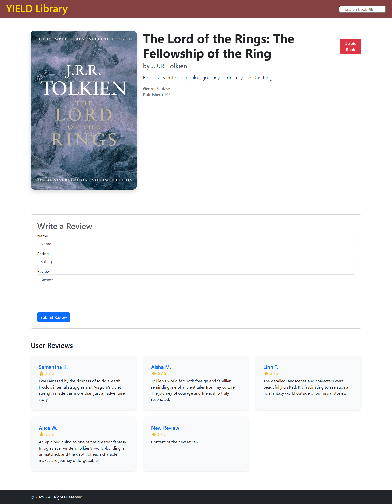

## React Book-Review Library

🔗 𝐁𝐚𝐜𝐤-𝐞𝐧𝐝: https://github.com/nelvison-benedetto/webapp-express

Project developed using React.js to create a dynamic, responsive, and user-friendly interface for managing books and user reviews. This frontend interacts seamlessly with a RESTful API backend (built with Node.js, Express, and MySQL), providing full CRUD capabilities for both books and associated reviews.

---
### Key features include:
- React Router for navigation
- Context API for global state
- Dynamic book filtering
- Book details with cover images
- User reviews (add, view)
- Responsive layout with Bootstrap

---
### Environment Variables
You can define these in an .env file or export them:
```env
VITE_REACT_HOST=http://localhost
VITE_REACT_PORT=3001

REACT_DB_HOST=localhost
REACT_DB_PORT=your_database_port
REACT_DB_USER=your_database_user
REACT_DB_PSW=your_database_password
REACT_DB_NAMEDB=your_database_name
```

---
### Run project
1. Clone this repository
2. Run the Back-end
3. Install dependencies and start the app

```bash
npm install
npm run dev
```


